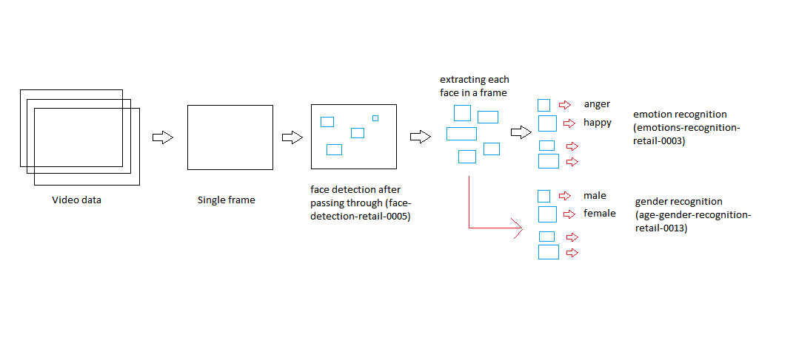
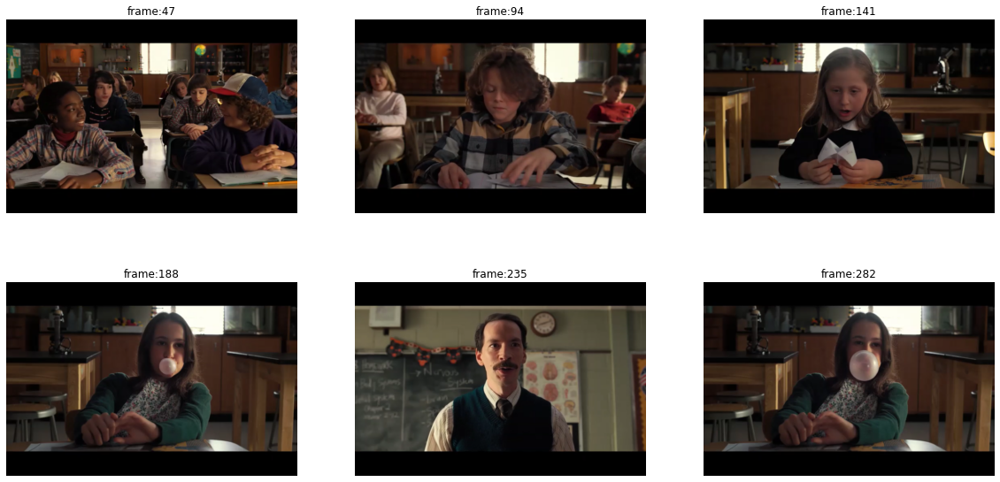
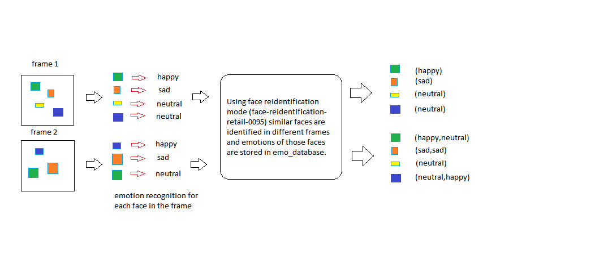

# Project Title: OpenVino Emotion Analysis

This project aims at building a pipeline that identifies each student/lecturer in the classroom and captures the emotions of each one of them. In the end, it generates the report card of each student/lecturer which will tell the overall fluctuations in the behaviour of the student/lecturer through the day.


## Prerequisites
[Note: Only works in windows not tested for linux/MacOS]

1. Download and install [OpenVino](https://docs.openvinotoolkit.org/2019_R3.1/_docs_install_guides_installing_openvino_windows.html) along with other dependency software and run the demo mentioned in the installation guide to check everything installed properly.[Note: I used openvino version 2019_R3.1]
2. Download and install [Anaconda](https://www.anaconda.com/distribution/#windows) with python 3.x.

## Getting Started

1. Clone this repo
```git
  git clone https://github.com/apthagowda97/openvino_emotion_analysis.git
```
2. Open Command Prompt and change the directory to the cloned repository and run the below commands
```
  C:\> cd [path]\openvino_emotion_analysis
  C:\[path]\openvino_emotion_analysis> run.bat
  C:\[path]\openvino_emotion_analysis> jupyter notebook
```
3. run notebooks ``` emotion_analysis.ipynb``` and ``` emotion_analysis_explained.ipynb ``` 

# Description
## Phase 1: 


### 1. Breaks the video data into frames.


### 2. Takes singel frame at a time.
.png)

### 3. Runs the [face-detection-retail-0005](http://docs.openvinotoolkit.org/latest/_models_intel_face_detection_retail_0005_description_face_detection_retail_0005.html) to identify different student face.
.png)
.png)

### 4. Runs the [age-gender-recognition-retail-0013](http://docs.openvinotoolkit.org/latest/_models_intel_age_gender_recognition_retail_0013_description_age_gender_recognition_retail_0013.html) to identify the gender of the face.
.png)

### 5. Runs the [emotions-recognition-retail-0003](http://docs.openvinotoolkit.org/latest/_models_intel_emotions_recognition_retail_0003_description_emotions_recognition_retail_0003.html) to recognize 5 emotions [neutral,happy,sadness,surprise,anger].
.png)
.png)

### 6. Plots the overall emotion of the frame and add that to the frame.
.png)
.png)

## Phase 2:


### 1. All different faces detected by [face-reidentification-retail-0095](http://docs.openvinotoolkit.org/latest/_models_intel_face_reidentification_retail_0095_description_face_reidentification_retail_0095.html) model.
.png)

### 2. Face database after clipping those person faces with count below 15.
.png)

### 3. Output video (gif)


## Emotion analysis report

### 1.1 Face database of (Face ID : FACE_0)
.png)

### 1.2 Emotion analysis of (Face ID :FACE_0) 
.png)

### 2.1 Face database of (Face ID :FACE_1)
.png)

### 2.2 Emotion analysis of (Face ID :FACE_1) 
.png)

### 3.1 Face database of (Face ID :FACE_2)
.png)

### 3.2 Emotion analysis of (Face ID :FACE_2) 
.png)


### 4.1 Face database of (Face ID :FACE_3)
.png)

### 4.2 Emotion analysis of (Face ID :FACE_3) 
.png)

## Uses
1. It can be installed in a classroom to monitor the real-time behaviour of the students and report those students whose behaviour is below some threshold.
2. It gives privacy to the students and everything is done at the edge. There is no need to store student face database to recognize. It ll create as it captures a different face and reports only those students whose behaviour is below par.

## Author

* **Aptha Gowda** 

## Acknowledgments

* Netflix for Stranger things Short Clip
* Intel openvino scholarship
